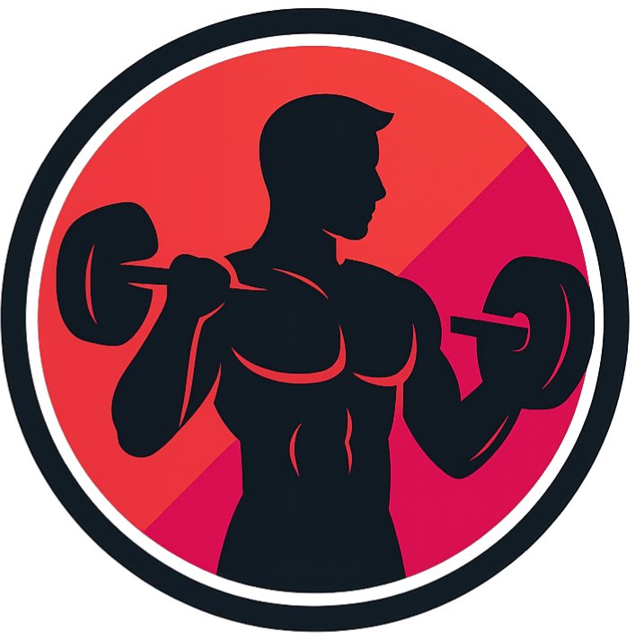

# FitZone

Proyecto realizado como prueba técnica de NTT Data donde se busca explorar el conocimiento en Angular y el correcto uso de sus herramientas.

## Objetivo

El candidato deberá demostrar su capacidad para diseñar, desarrollar y entregar un MVP funcional utilizando Angular 17+, con énfasis en calidad del código, experiencia de usuario, organización del proyecto, y capacidad para simular una arquitectura realista sin depender de un backend.

## 🚀 Tecnologías utilizadas

- [Angular V19](https://angular.io/)
- TypeScript
- Signals (Angular v16+)
- LocalStorage API
- angularx-qrcode
- idb (IndexedDB)
- Jasmine/Karma para testing

## Ejecución del proyecto

Para correr el proyecto, se debe ejecutar el siguiente comando:

```bash
ng serve
```

Al cargar el proyecto se ejecutan Seeders que se pueden encontrar en:

```cmd
cd [user:path]/src/mocks/seeders
```

Con esto se genera la información necesaria para empezar a trabajar el proyecto. IndexedDB actuará como la persistencia principal y en algunos casos se implementa también LocalStorage.

### Persistencia

Como se menciono se implemento IndexedDB mediante la librería idb. La configuración se puede encontrar en:

```cmd
cd [user:path]/src/mocks/fake-db.ts
```

De igual manera se utilizan dos variables en LocalStorage, estas son **user** y **cart**, las cuales almacenan la información del usuario en sesión y la lista de clases agregadas al carrito respectivamente.

#### Peticiones e interceptor

Se busco una manera de hacer más estable el consumo del Mock, ya que IndexedDB permite realizar consultas y registros de manera eficiente se puede simular un comportamiento de API Rest, esto permite implementar un **Interceptor** por parte de Angular, para que capture las peticiones HTTP y extraiga la data del "falso back".

Esta medida tiene un segundo proposito, al permitir realizar desarrollos y pruebas de una manera más realista y escalable. Tmabién brindando una posible alternativa ante un caso offline.

## Componentes y estilos

Durante el desarrollo solo se implemento un componente externo, el cual fue el código QR, los demás fueron creados y configurados para el proyecto. De la misma manera, no se implemento framework de diseño y se conservo el uso natural de Scss.
